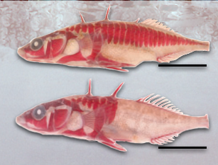

```{r, include = F}
library(tidyverse)
library(shiny)
library(gifski)
library(gganimate)
```

```{r calc,echo=F}
next_gen <- function(gen_table,fAA,fAa,faa){
  
  num <- nrow(gen_table)
  
  last <- gen_table %>% slice(num)
  
  old_AA <- last %>% pull(AA)
  old_Aa <- last %>% pull(Aa)
  old_aa <- last %>% pull(aa)
  
  new_AA <- old_AA * fAA
  new_Aa <- old_Aa * fAa
  new_aa <- old_aa * faa
  total <- new_AA + new_Aa + new_aa
  new_AA <- new_AA / total
  new_Aa <- new_Aa / total
  new_aa <- new_aa / total
  
  new_pA <- (2*new_AA + new_Aa) / 2
  
  new_AA <- new_pA^2
  new_Aa <- 2*new_pA*(1-new_pA)
  new_aa <- (1-new_pA)^2
  
  old_gen <- last %>% pull(Gen)
  new_table <- gen_table %>%
    add_row(Gen = old_gen+1, AA = new_AA, Aa = new_Aa, aa = new_aa,pA = new_pA)
  return(new_table)
}
```


We often talk about evolution having to do with genes, but what exactly does
that mean? A **gene** is the "fundamental unit of heredity", corresponding to a 
specific segment of DNA and which carries information.[^1] The place on the 
chromosome where this gene is located is usually called a **locus**.[^2] Every
individual receiives two copies of each gene, one from each parent. The specific
sequence that is received is called an **allele**. For most genes, there are multiple
different possible alleles that an individual could receive, and which ones they
have can determine many important characteristics. Each individual will
have two alleles. 
  
When we talk about a locus, we are talking about how the proportions of 
different alleles that are possible at that locus change over time. If one pair of
alleles is more advantageous for an organism than another, it will be selected
for. This is referred to as **fitness** - how effective an individual with a 
certain pair of alleles is at surviving and reproducing.[^3]  
  
This explorable explanation will look at two examples of evolution at a single
locus and show how the proportion of alleles changes over time.


## Stickleback fish

One interesting example of a single locus that can be easily seen is in the
"armor" of the threespine stickleback fish. There are several populations of this
fish, some of which have an "armor" made of bony plates along their back, as 
can be seen in the top photo. 



This
trait has been found to be mostly controlled by a single locus, with two
different possible alleles.[^4] These alleles can be represented as A and a. 
Individuals homozygous for the A allele (**AA**) have full platings. Individuals
homozygous for the a allele (**aa**) have very little plating. Individuals that
are heterozygous (**Aa**) mostly had partial plates.  
  
These "armor" platings are advantageous for stickleback fish because they give
protection against predators. The bony armor offers both protection against 
puncture as well as making the fish more difficult to swallow so that they
can escape a predator's attack.[^5]  
  
Knowing this, we can simulate what the evolution of this trait might have been
like. Among all the alleles in the population, some percentage will be **A** and
the rest **a**. We will start with 30% **A**, but you can adjust the starting
proportion with a slider. You can also adjust the number of generations simulated.
Below, we have relative **fitness** values for each pair of alleles in this
environment (**phenotype**). The most advantageous phenotype has a value of 1.
The rest have fractional values that represent how effective they are
at reproducing and passing on their genes. A individual with a relative fitness
of 0.75 would be expected to produce 75% of the offspring of the "best" phenotype.
We will start with full armor as the most advantageous, with partial and minimal
armor less adaptive. By tracking the curve, you can see how the proportion of 
**A** alleles in the population would be expected to change. You can change
any of the parameters of the simulation and click **Recalculate!** to see what
would happen (it may take a few seconds to update).


```{r shiny-input-1,echo=F}
fluidRow(
  column(6,
         sliderInput("gens",label = "number of generations",
                     min = 50,max = 500,value = 200,step = 5,width = "auto")),
  column(6,
         sliderInput("pA0", label = "Starting proportion of Allele A:",
              min = 0, max = 1, value = 0.3, step = 0.001,width = "auto"))
)
fluidRow(
  column(4,
         numericInput("fitAA","fitness of AA (full armor)",value = 1,
                      min = 0,max = 1,step = 0.01,width = "auto")),
  column(4,
         numericInput("fitAa","fitness of Aa (partial armor)",value = 0.98,
                      min = 0,max = 1,step = 0.01,width = "auto")),
  column(4,
         numericInput("fitaa","fitness of aa (minimal armor)",value = 0.95,
                      min = 0,max = 1,step = 0.01,width = "auto")),
)
fluidRow(
  actionButton("calc", "Recalculate!",icon = icon("dna"),
               style="color: #fff; background-color: #337ab7; border-color: #2e6da4")
)
```


```{r shiny-render-1,echo=F}
renderImage({
  
  #dependency on action button
  input$calc
  
  init_A <- isolate(input$pA0)
  init_AA <- init_A^2
  init_Aa <- 2*init_A*(1-init_A)
  init_aa <- (1-init_A)^2

  fit_AA <- isolate(input$fitAA)
  fit_Aa <- isolate(input$fitAa)
  fit_aa <- isolate(input$fitaa)
  
  num_gens <- isolate(input$gens)
  
  gen_table <- tibble("Gen"=0,"AA"=init_AA,"Aa"=init_Aa,"aa"=init_aa,"pA"=init_A)
  
  for(i in 1:num_gens){
    gen_table <- next_gen(gen_table,fit_AA,fit_Aa,fit_aa)
  }
  
  p <- ggplot(gen_table,aes(Gen,pA)) +
    geom_line(color="red")+
    ylim(0,1) + 
    labs(y = "proportion of A alleles",x="Generation",
         title="Evolution at sticklefish \"armor\" locus") +
    theme_gray(base_size = 16) +
    transition_reveal(Gen)
  
  outfile <- tempfile(fileext='.gif')
  
  anim_save("outfile.gif",animate(p,nframes=25,end_pause=10,width=900,height=400))

    # Return a list containing the filename
  list(src = "outfile.gif",contentType = 'image/gif')
  
},deleteFile = TRUE
)
```


## Malaria and Sickle-Cell Anemia

describe it  
  
link to balancing selection

```{r shiny-input-2,echo=F}
fluidRow(
  column(6,
         sliderInput("gens2",label = "number of generations",
                     min = 50,max = 500,value = 100,step = 5,width = "auto")),
  column(6,
         sliderInput("pA02", label = "Starting proportion of Allele A:",
              min = 0, max = 1, value = 0.5, step = 0.001,width = "auto"))
)
fluidRow(
  column(4,
         numericInput("fitAA2","fitness of AA (both normal)",value = 0.95,
                      min = 0,max = 1,step = 0.01,width = "auto")),
  column(4,
         numericInput("fitAa2","fitness of Aa (1 normal 1 sickle)",value = 1,
                      min = 0,max = 1,step = 0.01,width = "auto")),
  column(4,
         numericInput("fitaa2","fitness of aa (both sickle)",value = 0.75,
                      min = 0,max = 1,step = 0.01,width = "auto")),
)
fluidRow(
  actionButton("calc2", "Recalculate!",icon = icon("dna"),
               style="color: #fff; background-color: #337ab7; border-color: #2e6da4")
)
```


```{r shiny-render-2,echo=F}
renderImage({
  
  #dependency on action button
  input$calc2
  
  init_A <- isolate(input$pA02)
  init_AA <- init_A^2
  init_Aa <- 2*init_A*(1-init_A)
  init_aa <- (1-init_A)^2

  fit_AA <- isolate(input$fitAA2)
  fit_Aa <- isolate(input$fitAa2)
  fit_aa <- isolate(input$fitaa2)
  
  num_gens <- isolate(input$gens2)
  
  gen_table2 <- tibble("Gen"=0,"AA"=init_AA,"Aa"=init_Aa,"aa"=init_aa,"pA"=init_A)
  
  for(i in 1:num_gens){
    gen_table2 <- next_gen(gen_table2,fit_AA,fit_Aa,fit_aa)
  }
  
  p2 <- ggplot(gen_table2,aes(Gen,pA)) +
    geom_line(color="red")+
    ylim(0,1) + 
    labs(y = "proportion of A alleles",x="Generation",
         title="Evolution at human sickle cell (beta-globin) locus") +
    theme_gray(base_size = 16) +
    transition_reveal(Gen)
  
  outfile2 <- tempfile(fileext='.gif')
  
  anim_save("outfile2.gif",
            animate(p2,nframes=25,end_pause=10,width=900,height=400))

    # Return a list containing the filename
  list(src = "outfile2.gif",contentType = 'image/gif')
  
},deleteFile = TRUE
)
```


## References

[^1]:Griffiths, A.J.F., Miller, J.H., Suzuki, D.T., et al. 
(2000). *An Introduction to Genetic Analysis*. 7th edition.
New York: W. H. Freeman. Chapter 2, Patterns of Inheritance. 
Available from: https://www.ncbi.nlm.nih.gov/books/NBK22006/
[^2]:Willis, J. (2020). Bio 202 Lecture 5: Variation and Inheritance at a
Single Locus [PowerPoint slides]. 
[^3]:Willis, J. (2020). Bio 202 Lecture 15: Natural Selection [PowerPoint slides]. 
[^4]:Colosimo P.F., Peichel C.L., Nereng K., Blackman B.K., Shapiro M.D.,
Schluter D., et al. (2004) 
*The Genetic Architecture of Parallel Armor Plate Reduction in Threespine Sticklebacks*. 
PLoS Biol 2(5): e109. https://doi.org/10.1371/journal.pbio.0020109
[^5]:Reimchen, T. (2000). 
*Predator Handling Failures of Lateral Plate Morphs in Gasterosteus aculeatus: Functional Implications for the Ancestral Plate Condition.* Behaviour, 137(7/8), 1081-1096. Retrieved April 20, 2020, from
www.jstor.org/stable/4535758